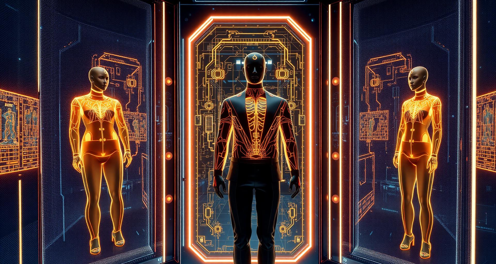

<div align="center">

  <h1>✨ ZIVARA — Wear The Future</h1>
  <p><strong>A Luxury AI-Powered Fashion E-Commerce Platform featuring Apple-Style 3D Scroll Canvas & Real-Time AI Virtual Try-On</strong></p>

  <p>
    
    
    
    
    
    
    
  </p>

  <br />

  

</div>

<br />

---

## 🌟 Overview

**ZIVARA** is a next-generation luxury fashion e-commerce application designed to revolutionize online shopping. By combining ultra-sleek modern design aesthetics with **Google Gemini Generative AI**, ZIVARA closes the gap between digital shopping and physical fitting rooms. 

Whether exploring the interactive Apple-style 3D hero canvas or trying on garments virtually with personal photos, ZIVARA offers an unforgettable, futuristic user experience.

---

## 🎬 Highlighted Signature Features

### 🍏 1. Apple-Style 3D Scroll Canvas Hero Section
Inspired by Apple’s iconic product reveals, ZIVARA features a high-performance **HTML5 Canvas 3D Scroll Animation Hero Banner**:
* **Smooth Frame Interpolation:** As the user scrolls down the landing page, a high-resolution sequence of luxury fashion apparel smoothly animates frame-by-frame.
* **Dynamic Scale & Parallax:** Garment textures zoom and reveal details naturally aligned with scroll progress.
* **Interactive Overlay & Micro-Animations:** Floating glassmorphic typography, luxury CTA buttons, and real-time scroll progress indicators bring the hero section to life.

<div align="center">
  
  
  
</div>

---

### 🤖 2. Generative AI Virtual Try-On (Photo Try-On Engine)
Shopping online often leaves customers guessing how clothes will actually look on them. ZIVARA solves this with a built-in **AI Virtual Try-On Studio** powered by **Google Gemini Vision**:

#### 📸 How Photo Try-On Works:
1. **Choose Any Garment:** Select from over 50+ catalog items across Men, Women, Kids, or Accessories (Suits, Jackets, Sarees, Dresses, Handbags, Sunglasses, Jewelry, Watches, Belts).
2. **Upload Your Photo:** Customers upload a clear personal photo or pick from built-in model presets.
3. **Multimodal AI Processing:** The system transmits the user's photo and chosen garment image to the **Google Gemini 2.5 AI Vision** backend with custom spatial prompts.
4. **Realistic Cloth Fitting & Drape Simulation:** The AI seamlessly renders the clothing onto the customer's body—preserving original pose, skin lighting, natural fabric folds, and shadows.
5. **Instant Download & Purchase:** Customers can preview the result, share it, or add the item straight to their cart!

---

### 🛍️ 3. Comprehensive E-Commerce Experience
* **50+ Trending HD Products:** Dynamic catalog with Men, Women, Kids, and Wearable Accessories categories.
* **Live Search & Category Filtering:** Instant client-side filtering by category, price, new arrivals, and sale items.
* **Smart Shopping Cart & Coupons:** Dynamic subtotal calculation, discount coupon code validation, and free shipping triggers.
* **Order Tracking Pipeline:** Visual order status timeline (Pending ➔ Confirmed ➔ Processing ➔ Shipped ➔ Delivered).
* **Firebase & JWT Security:** Multi-role authentication (Customer, Moderator, Admin, Super Admin) with backend token verification.

---

### ⚡ 4. Advanced Admin Control Center & Demo Mode
* **Analytics Dashboard:** Visual sales and revenue charts powered by Recharts.
* **Full CRUD Operations:** Manage Products, Categories, Coupons, Sliders, Orders, and User Roles.
* **Portfolio Demo Mode:** Built-in automatic Demo Mode (`VITE_IS_DEMO`) that safely simulates database mutations for static hosting showcases (Netlify / Vercel).

---

## 🛠️ Technology Stack

| Layer | Technologies |
| :--- | :--- |
| **Frontend Framework** | React 18, TypeScript, Vite 5 |
| **Styling & UI** | Tailwind CSS v3.4, shadcn/ui, Lucide React, Glassmorphism CSS |
| **Animations** | Framer Motion, HTML5 Canvas 3D Frame Animation Engine |
| **Artificial Intelligence** | Google Gemini 2.5 Flash / Flash-Lite Multimodal Vision API |
| **Backend API** | Node.js, Express.js |
| **Database** | MongoDB (Mongoose ORM) |
| **Authentication** | Firebase Auth (Google OAuth & Email/Password) + JWT Verification |
| **State & Data Fetching** | React Context API, TanStack React Query v5 |

---

## 💻 Installation & Local Setup

### Prerequisites
- [Node.js](https://nodejs.org/) (v18.0 or higher)
- [npm](https://www.npmjs.com/) or [yarn](https://yarnpkg.com/)
- [MongoDB](https://www.mongodb.com/) instance (Local or MongoDB Atlas)
- Google Gemini API Key

### 1. Clone the Repository
```bash
git clone https://github.com/zibonmadbor/ZIVARA1.git
cd ZIVARA1
```

### 2. Frontend Setup
```bash
# Install frontend dependencies
npm install

# Start Vite development server
npm run dev
```

### 3. Backend Setup
```bash
# Navigate to server folder
cd server

# Install backend dependencies
npm install

# Start Express development server
npm run dev
```

---

## 🔐 Environment Variables Configuration

Create a `.env` file in the root directory for frontend settings:
```env
VITE_FIREBASE_API_KEY=your_firebase_api_key
VITE_FIREBASE_AUTH_DOMAIN=your_project.firebaseapp.com
VITE_FIREBASE_PROJECT_ID=your_project_id
VITE_FIREBASE_STORAGE_BUCKET=your_project.appspot.com
VITE_FIREBASE_MESSAGING_SENDER_ID=your_messaging_sender_id
VITE_FIREBASE_APP_ID=your_app_id
```

Create a `.env` file in the `server/` directory for backend settings:
```env
PORT=5000
MONGODB_URI=mongodb+srv://your_mongo_credentials
GEMINI_API_KEY=your_google_gemini_api_key
JWT_SECRET=your_jwt_secret_key
```

---

## 👥 Project Team & Credits

- **Full-Stack Development:** Zibon Madber & Hafizur Rahman
- **Project Planning & Architecture:** Mahfuz Hossain

---

<div align="center">
  <p>Made with ❤️ for the future of fashion e-commerce.</p>
</div>
